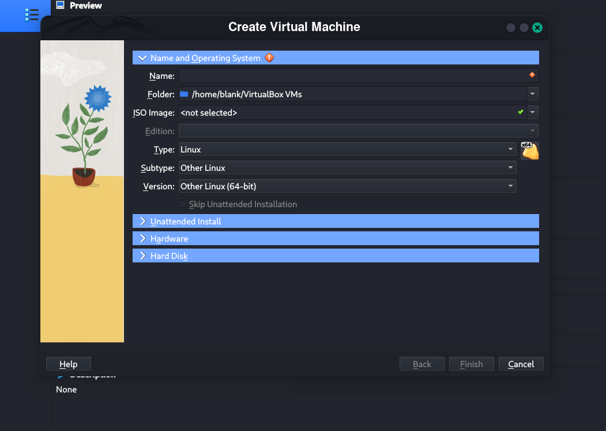
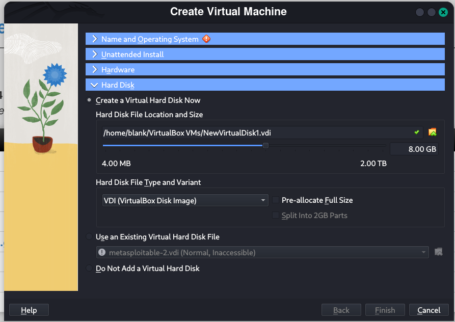
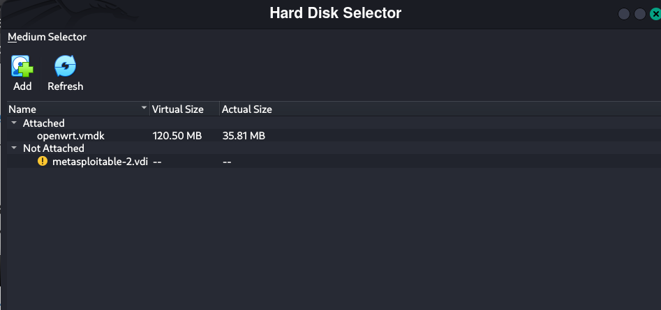
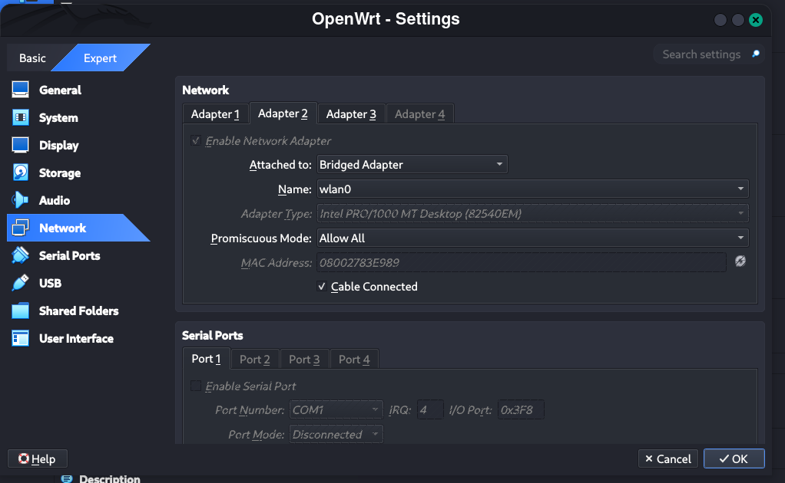
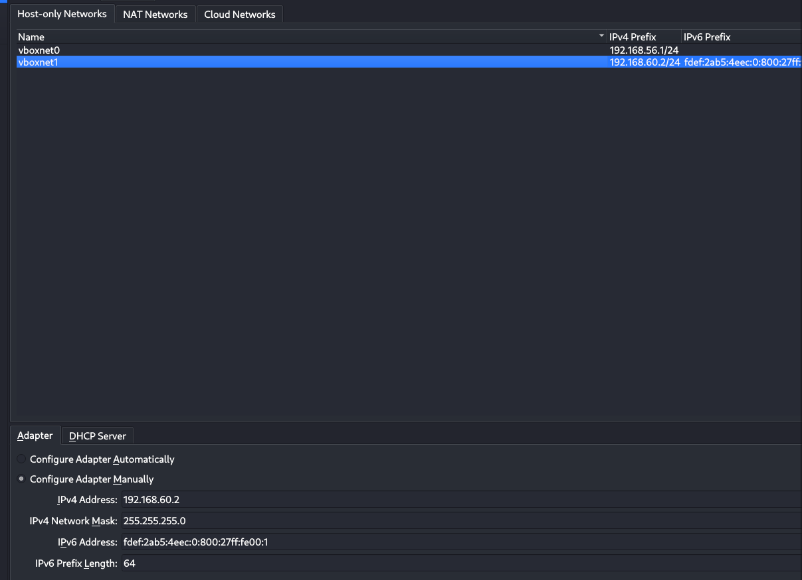
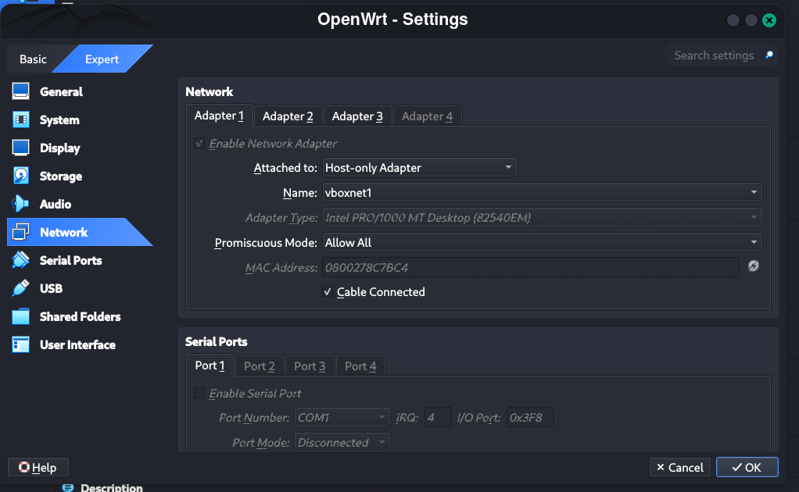
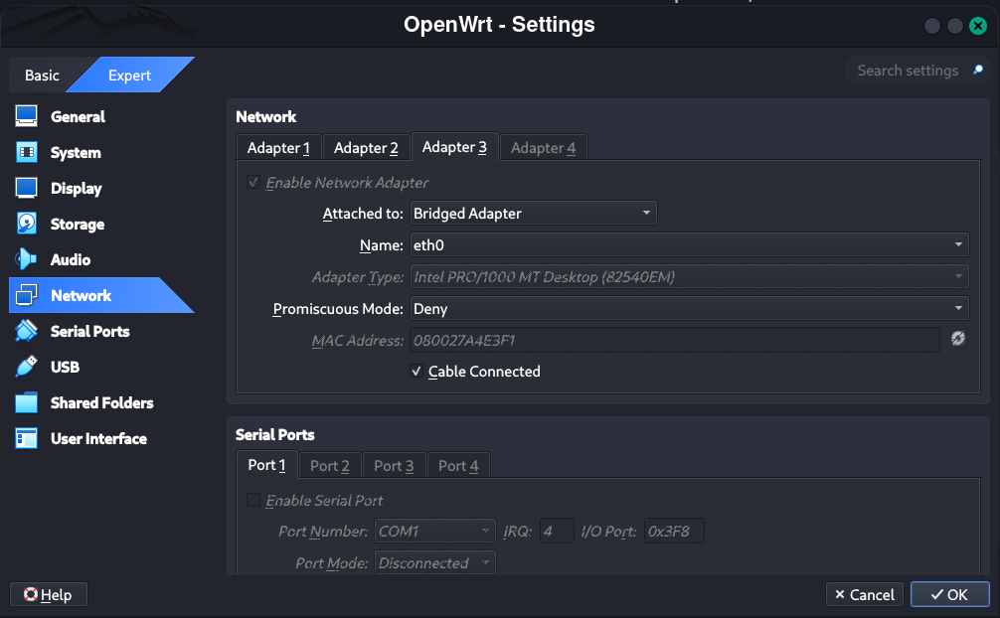
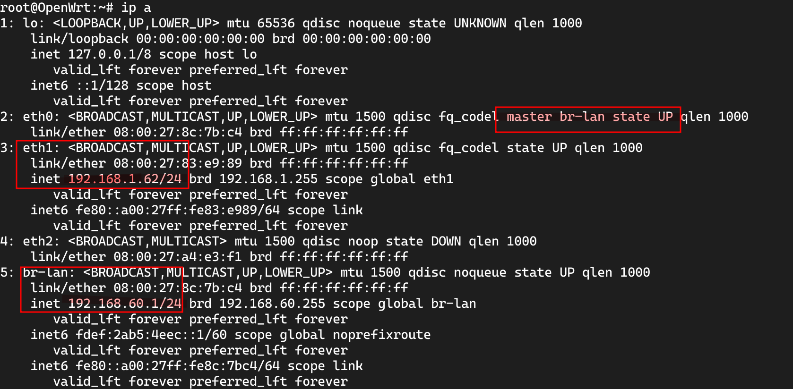
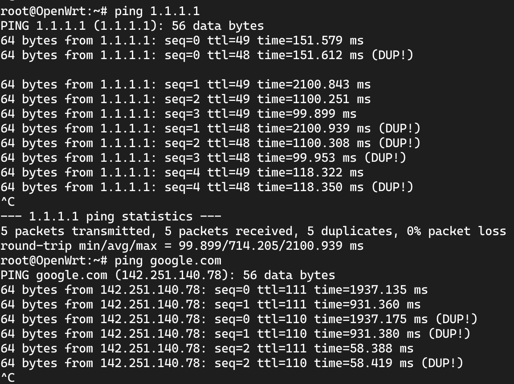
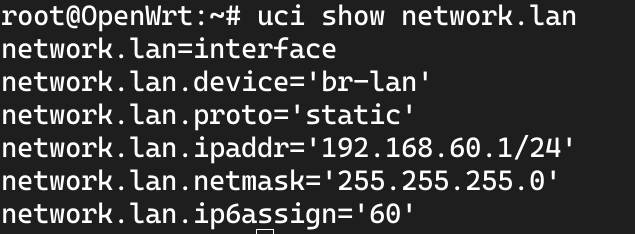

# Basic OpenWrt VM Configuration (VirtualBox)
One can simple clone the repo and arrive at a working setup but I left how I arrived at this point for my reference

This document is a quick reference for setting up an OpenWrt virtual machine in **VirtualBox**.  
It’s mainly a personal note so I don’t forget the setup steps and configurations.

---

## 🧰 Prerequisites

- [VirtualBox](https://www.virtualbox.org/) installed  
- OpenWrt x86_64 image file (downloaded from [OpenWrt releases](https://downloads.openwrt.org/releases/24.10.3/targets/x86/64/))

---
I used this video here as a reference to help me set this [video](https://www.youtube.com/watch?v=4lgnqKy5qfU&list=WL&index=3) up. you can watch for reference.

## ⚙️ Setup Steps

1. **Download the Image**  
   Get the first image file (`combined-ext4.img.gz` or similar) from the [OpenWrt releases page](https://downloads.openwrt.org/releases/24.10.3/targets/x86/64/).

2. **Create a New Virtual Machine**  
   Open VirtualBox → click **New**.  
   

3. **Skip ISO Selection**  
   When asked for an installation ISO, **choose “Skip”** or **continue without an ISO**.

4. **Set Hardware Resources**  
   - Memory: **1024 MB**  
   - CPU Cores: **2**  
   (These worked fine for me.)

5. **Attach Existing Disk**  
   In the storage configuration, select **“Use an existing virtual hard disk file”**.  
   

6. **Choose the OpenWrt Image**  
   Click the **yellow file icon** → **Add** → navigate to where the extracted `.img` file is located.  
   

7. **Finish VM Setup**  
   Complete the wizard, name your VM, and you’re ready to go.

8. **Start the VM**  
   Boot it up — **voilà!** You have a running OpenWrt instance inside VirtualBox.

>[!Note] To get a CLI
> give things a moment to boot up and then press enter, by default the system will stop printing logs when it finishes loading everything but nothing will happen if you don't press Enter

The VM should be working now and you should have a CLI as root, but you don't have any networking set up. 


# Network setup 

OpenWrt is a system made for routers so setting this part up is important. 

This setup has two parts 

1. Virtual box setup 
2. Inside the VM setup 

**Beginning with Virtual box** , OpenWrt needs to have at least 2 network adapters set, one for WAN , the other for LAN.

### **Network Interfaces in OpenWrt**
* **WAN adapter** connects to the internet either through NAT or bridging the adapter to an internet facing NIC 
* **LAN adapter** connects the Host device and the VM through in LAN config through a bridged adapter to a **Host-only network**
* **br-lan**: the adapter which OpenWrt uses as its NIC this one needs to  be on the same subnet as the LAN adapter 

## **Steps**: 

*In virtual box*
1. open files and press network manager
2. set the second IP in the subnet for the host only network, name it whatever. also make sure to disable the dhcp server in the tab seen in the picture
3. go to the Network settings of the VM Enable adapter 1 and follow this config this will be our connection between HOST and VM
4. Enable the second adapter  , this will be the WAN and it should be internet facing. you can set this to NAT or bridge it to an internet facing adapter as I did in this image
5. ***Optional***: I also bridged the Host's ethernet adapter since I might connect something to it later on

With this the Virtual Box side of Networking is done. 

---
*In the VM* ,

1. we will be confirming the file /etc/config/network file matches this setup using `vim /etc/config/network`
```
config interface 'loopback'
	option device 'lo'
	option proto 'static'
	option ipaddr '127.0.0.1'
	option netmask '255.0.0.0'

config globals 'globals'
	option ula_prefix 'fdef:2ab5:4eec::/48'

config device
	option name 'br-lan'
	option type 'bridge'
	list ports 'eth0'

config interface 'lan'
	option device 'br-lan'
	option proto 'static'
	option ipaddr '192.168.60.1/24'
	option netmask '255.255.255.0'
	option ip6assign '60'

config interface 'wan'
	option device 'eth1'
	option proto 'dhcp'

```
make sure that ***config interface 'lan'*** section doesn't list the internet facing adapter as a port. **having eth0 as a port is normal and expected as it is the connection between host and the router (OpenWrt)** 

>[!Note] Note that
eth0 is adapter 1 
eth1 is adapter 2 
eth3 (not seen here) is adapter 3

2. save and exit the file and we restart the VM
3. we now set some IPs and do some configurations using `uci` tool
```
uci set dropbear.@dropbear[0].Port=4533 uci commit dropbear
/etc/init.d/dropbear reload
uci set network.lan.ipaddr=192.168.60.1
uci commit && reboot

```

here we did two things: 
First, we set the IP of the br-lan interface to 192.168.60.1 to make sure that the host and the VM are connected to the same network
>[!Note] NOTE 
>The WebUI can be accessed on the IP 192.168.60.1 , with username root and no password

second, we changed the SSH utility in OpenWrt, dropbear, to use port 4533. ( for no apparent reason , I just followed a guide :)

4. we now edit the firewall to allow for SSH connections and set in its configs

for that we edit the firewall config file as follows 
`vim /etc/conig/firewall`
and add this to the very bottom of the file

```
 # USER IMPLEMENTED RULES :)
config rule
	option name 'Allow-ssh'
	option src 'wan'
	option proto 'tcp'
	option dest_port '45333'
	option target 'ACCEPT'
	option family 'ipv4'


```
save and exit then `/etc/init.d/firewall reload`
`/etc/init.d/firewall restart`  for good measure. 

5. Finally, we edit `vim /etc/dnsmasq.conf` to configure the DNS server

add the following lines to the very bottom of the file 

```
server = 8.8.8.8
server = 1.1.1.1
```

6. Testing everything works is done as follows

**View the IP addresses of the interfaces**

1. `ip a` produces the following

* make sure that one interface is on the same subnet as your internet facing NIC or it has an IP assigned inside the NAT subnet if you used NAT
* make sure that the first IP of the Host-only network belongs to the br-lan interface
* Finally, as reflected in the /etc/config/network file eth0 says that its master is br-lan

2. `ping` is the next tool to use to make sure  things are connected.
we first `ping 1.1.1.1` to make sure internet is connected ( no idea what this DUP! , why am I getting duplicates from the response but I am assuming its related to the idea that our internet facing NIC is bridged)

we next `ping google.com` or any other website to make sure the DNS works

we finally check the LAN config by doing a
`uci show network.lan`]
and generally (I think ) `uci show` shows all configs but its too much and I am not bothered to read all of it now, but if there is some mistake somewhere you will have to sift through its output with `grep` 

---
# Last step

for good measure you could reboot and do 
`opkg update` and install some packages if you want

## Summary: 

* The webui is at `192.168.60.1`
* The Host and VM are connected through a bridged adapter to a Host-only network in the subnet `192.168.60.x/24` 
* SSH to the router is done by using           	`ssh root@192.168.60.1 -p 4533` , no password required
